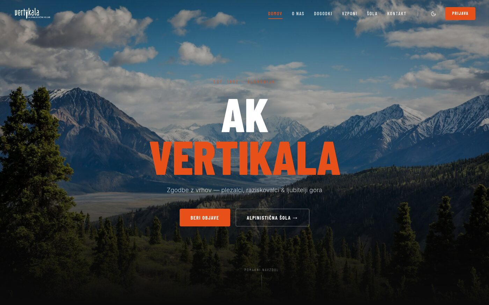
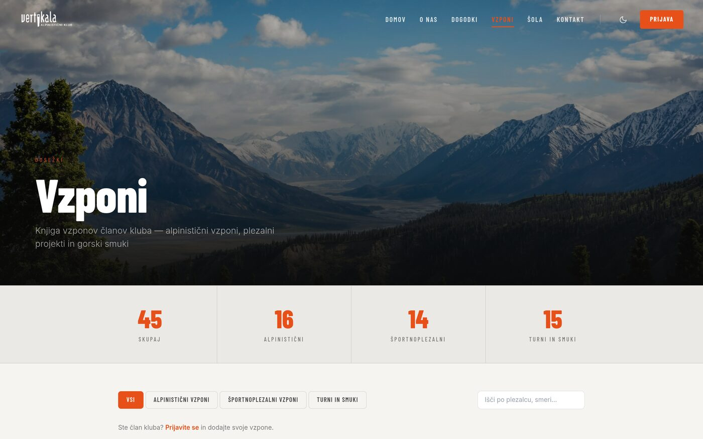
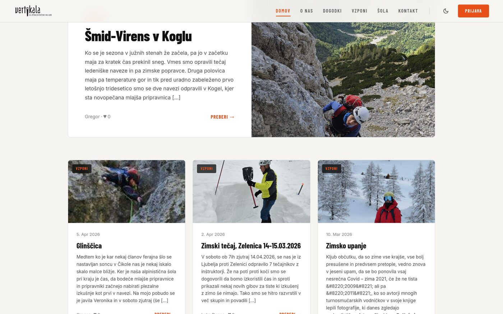
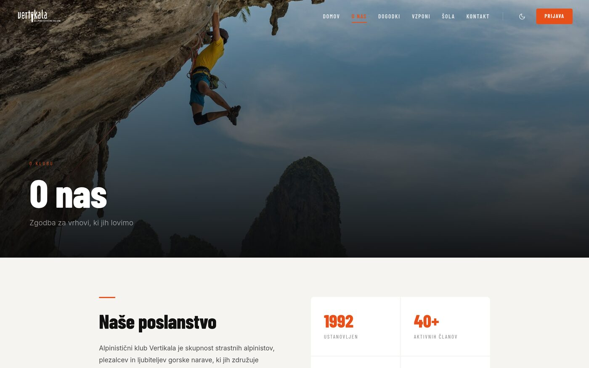

# Vertikala

A full-stack web app built for **AK Vertikala**, a Slovenian alpine club, to replace its old WordPress site. Members log ascents, browse trip reports, sign up for events, and manage everything through a role-gated admin panel — all backed by Supabase with row-level security.

**Live:** [vertikala.pages.dev](https://vertikala.pages.dev/)



## Features

- **Trip report feed** — members publish posts with a rich-text editor (TipTap: images, links, YouTube embeds), tagging, likes, and comments.
- **Ascents log ("Vzponi")** — a searchable, filterable database of the club's climbs (alpine, sport, ski tours) with live stats.
- **Camps ("Tabori")** and **events** — schedules members can browse and sign up for.
- **Admin dashboard** — role-based access (member / admin / owner) for managing posts, members, invites, and an audit log; posts get a 30-day soft-delete trash before permanent purge.
- **Member-only registration** — accounts are invite-only, gated by Supabase Auth; the admin panel itself sits behind an additional MFA gate.
- **Mountain weather widget** — live forecasts for Slovenian peaks (Triglav, Grintovec, Mangrt, Storžič) via the Open-Meteo API.
- Light/dark theme, responsive layout, and image galleries with a lightbox.



## Tech stack

| Layer | Choices |
|---|---|
| Frontend | React 18, Vite, React Router, Tailwind CSS, Radix UI, Framer Motion |
| Data / editor | TanStack Query, TipTap, react-leaflet, Recharts |
| Backend | Supabase (Postgres, Auth, Storage, Row-Level Security) |
| Hosting | Cloudflare Pages |

## Some engineering details

- **Code-split routes** — each page loads its own chunk, so the ~380 KB TipTap editor only ships to users who actually create or edit a post.
- **Stale-chunk recovery** — after a deploy, old clients that still have a previous session open get a one-time automatic reload instead of a blank white screen when their cached chunk hashes no longer resolve.
- **Scroll-position restoration** — going "back" from a post returns to the exact card you clicked, including across a page reload.
- **RLS-first authorization** — access control (who can edit/delete which rows) is enforced in Postgres policies, not just in the UI.



## Running locally

```bash
npm install
cp .env.example .env.local   # fill in your own Supabase project URL + anon key
npm run dev
```

Requires a Supabase project with the schema/policies under `supabase/*.sql` applied.

```bash
npm run build      # production build
npm run lint       # eslint
npm run typecheck  # tsc, config in jsconfig.json
```


